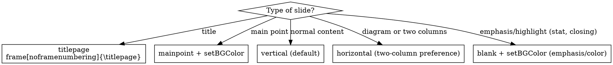

# UFGTeX-Presentation Template Guide

## Starting a new presentation

**Never edit `presentation.tex` directly.** It is the reference showcase — always copy it:

```bash
cp presentation.tex my-talk.tex
```

Work in the new file. `presentation.tex` stays intact as a living reference of all template features.

## Questions to ask before authoring a new presentation

**Section color strategy** — ask the user before writing any `mainpoint` frame:

> "Do you want a single color for all section transitions (more formal/unified) or a different color per section (more dynamic/energetic)?"

- **Single color**: use the same `\setBGColor` on every `mainpoint`. Suits academic, institutional, or technical presentations.
- **Per-section color**: assign one color from the palette to each section and keep it through all frames of that section. Suits talks, workshops, storytelling-driven content.

Do not assume a default — let the user decide once and apply consistently.

## Checklist when generating slides from an article or paper

When the source material references a figure, diagram, chart, or table that is central to the argument:
- Do not reproduce it in text — ask the user to provide the image in `figs/`
- Suggest: _"Figure X from the paper would strengthen this slide — place it in `figs/figX.png` and I'll add it."_
- Use `\includegraphics[width=\textwidth]{figs/figX.png}` inside a `0.45\textwidth` column or alone on a `blank` or `vertical` slide
- Only skip asking if the content is trivially reproducible as a TikZ diagram or table

## Checklist when writing a bio slide

- Place bio as slide 2 — right after `\titlepage`, before the agenda. Use `\setLayout{horizontal}` (no section, outside `\AtBeginSection` scope).
- Check if `figs/photo.png` exists. If not, warn the user — `\profilephoto` will render a colored hexagon with initials until the photo is added.
- Ask the user for their initials (first + last letter) to pass as the 3rd arg: `\profilephoto[3.2cm]{figs/photo.png}{FL}`

## Vertical Space Budget

Beamer 16:9 slides have ~96mm total height. After decorations and frametitle, usable vertical space:

| Layout | Usable height | Notes |
|---|---|---|
| `vertical` | ~7.0cm | Sidebar on right, frametitle top |
| `horizontal` | ~5.5cm | Bottom bar reduces height significantly |
| `blank` | ~8.0cm | No decorations, full area |
| `mainpoint` | title only | Body content silently ignored |

**Element height estimates (approximate):**

| Element | Height |
|---|---|
| Bullet item, 1 line | ~0.5cm |
| Bullet item wrapping to 2 lines | ~1.0cm |
| Bold header (`\textbf{}`) | ~0.6cm |
| Block with 1-line body | ~1.2cm |
| Block with 2-line body | ~1.8cm |
| Block with 3-line body | ~2.4cm |
| `\vspace{0.5em}` | ~0.2cm |
| `\vspace{0.8em}` | ~0.3cm |
| TikZ diagram (by y-coordinate range) | y_max × ~1cm per unit |

**Budget check — sum element heights and compare:**

| Layout | Budget |
|---|---|
| `vertical` | ~7.0cm |
| `horizontal` | ~5.5cm |
| `blank` | ~8.0cm |

Example: 4 bullets (2.0cm) + 2 blocks with 2-line body (3.6cm) + 2×`\vspace{0.8em}` (0.6cm) = **6.2cm → overflows horizontal (5.5cm), fits vertical (7.0cm)**.

**What happens when content overflows:**
Layout decorations (sidebar, footer bar) are rendered in the background — overflowing content passes OVER them, not behind. Content that exceeds the slide height is clipped at the frame boundary and simply disappears. There is no scrolling, no wrapping to next slide, no warning.

**When content exceeds budget:**
1. Split into two slides — never sacrifice readability
2. Shorten bullet text to one line each — wrapping doubles the height cost
3. Reduce block body to 1 line or convert to a bullet
4. Remove `\vspace` between elements
5. Use a table instead of stacked blocks when comparing items

Always prefer fewer items with more impact over exhaustive lists.

## Text Fitting Guidelines

Content must fit within the layout — never let text overflow margins or push elements off-slide. Strategies:

| Situation | Fix |
|---|---|
| Title too long on titlepage | Break into two lines with `\\`; title moves up automatically |
| Many authors on titlepage | Use multiple `\inst{}` columns — Beamer splits them horizontally |
| `\stat` label overflows column | Shorten label text; use `\footnotesize` override if needed |
| Block text too long for slide | Trim prose; split into two slides |
| Table too wide | Wrap in `\resizebox{\textwidth}{!}{...}` |

When generating content, prefer short labels — especially inside `\stat{}{}` and table cells.

## Core Constraint

`\textwidth` in this template ≈ **80% of `\paperwidth`** (left margin 5% + right margin 15%).  
**Always size content relative to `\textwidth`, never `\paperwidth`.**

## Layout Reference

| Layout | Visual marker | Text color | Safe content area |
|---|---|---|---|
| `vertical` | Right sidebar (~20% width) | Dark | `\textwidth` (80% of slide) |
| `horizontal` | Bottom bar (~12% height) | Dark | `\textwidth`, limited height |
| `blank` | None — solid PrimaryColor bg | **White** | Full `\textwidth` |
| `mainpoint` | None — solid bg + overlay | **White** | Title only (via `\frametitle{}`) |
| `titlepage` | Wide right sidebar + bottom bar | White | Use only with `\titlepage` |

`\setLayout{name}` persists to all following frames until changed.

## Layout Selection



## Logo Color Rule

**White variant** → logo on colored/dark surface (sidebar, bottom bar, `blank`/`mainpoint` bg, closing slide with `setBGColor`).  
**Black or color variant** → logo embedded in slide content area with white/light background (e.g. bio slide, acknowledgement on white).

## Commands

```latex
\setLayout{vertical}            % vertical | horizontal | blank | mainpoint | titlepage
\setBGColor{DarkOrange}         % changes bgcolor (persists)
\setPrimaryColor{UFGBlue}       % preamble only
\setLogos{title.png}{slide.png} % preamble only
```

**Available colors:** INFBlue, UFGBlue, DarkGray, LightGray, Ocean, DarkOrange, LightOrange, DarkGreen, LightGreen, LightPurple, DarkPurple, VeryLightGray

Color mixing works: `DarkOrange!80!black`, `UFGBlue!55`, `UFGBlue!60`

## Column Patterns

**HARD RULE: every frame with `\begin{columns}` MUST have `\setLayout{horizontal}` immediately before `\begin{frame}`.**  
`\AtBeginSection` resets to `\setLayout{vertical}` — you must set horizontal explicitly every time.

```latex
% Symmetric comparison
\setLayout{horizontal}
\begin{frame}{Title}
    \begin{columns}
        \column{0.5\textwidth}
        ...
        \column{0.5\textwidth}
        ...
    \end{columns}
\end{frame}

% Asymmetric text + diagram/image
\setLayout{horizontal}
\begin{frame}{Title}
    \begin{columns}
        \column{0.6\textwidth}
        ...
        \column{0.4\textwidth}
        \begin{center}
            \includegraphics[width=0.9\textwidth]{figs/figure.png}
        \end{center}
    \end{columns}
\end{frame}

% Bio slide (text + portrait)
\setLayout{horizontal}
\begin{frame}{Who am I}
    \begin{columns}
        \column{0.6\textwidth}
        ...
        \column{0.4\textwidth}
        \begin{center}
            \profilephoto[3.5cm]{figs/photo.png}{FL}
        \end{center}
    \end{columns}
\end{frame}
```

**Width rule:** column widths must sum to ≤ `\textwidth`. Never use `\paperwidth` as column base.

## TikZ Diagrams

Add to preamble: `\usetikzlibrary{positioning}`

### Reusable node styles

```latex
% Org-chart / hierarchy
rect/.style={rectangle, rounded corners=5pt, minimum height=0.72cm,
             align=center, font=\small\bfseries, text=white}
arr/.style={->, thick, color=gray!50}
darr/.style={->, thick, dashed, color=UFGBlue!60}   % secondary/implied relation

% Triangle / balance diagrams
vnode/.style={circle, minimum size=1.9cm, align=center,
              font=\scriptsize\bfseries, text=white}
```

### Hierarchy diagram (vertical layout)

```latex
\begin{center}
\begin{tikzpicture}[rect/.style={...}, arr/.style={...}]
    % Rows at y = 3.2, 2.2, 1.2, 0.1
    % Safe node width: up to 9.5cm (fits within \textwidth on 16:9)
    \node[rect, fill=DarkOrange, minimum width=9.5cm] (top) at (0, 3.2) {Top Level};
    \node[rect, fill=UFGBlue,    minimum width=4.5cm] (l)   at (-2.6, 2.2) {Left};
    \node[rect, fill=DarkPurple, minimum width=4.5cm] (r)   at (2.6, 2.2) {Right};
    \draw[arr] (top.south) -- ++(0,-0.15) -| (l.north);
    \draw[arr] (top.south) -- ++(0,-0.15) -| (r.north);
\end{tikzpicture}
\end{center}
\vspace{0.2em}
\begin{block}{}  % caption block below diagram
    Explanatory text.
\end{block}
```

### Triangle / balance diagram (column)

```latex
\begin{center}
\begin{tikzpicture}[vnode/.style={...}]
    \coordinate (A) at (0,    3.2);
    \coordinate (B) at (-2.4, 0.3);
    \coordinate (C) at ( 2.4, 0.3);
    \draw[thick, gray!35] (A) -- (B) -- (C) -- cycle;
    \node[vnode, fill=UFGBlue]    at (A) {Label A};
    \node[vnode, fill=DarkOrange] at (B) {Label B};
    \node[vnode, fill=DarkGreen]  at (C) {Label C};
\end{tikzpicture}
\end{center}
```

### Height budget in vertical layout

Frametitle + content must fit within ~7.5cm vertical space (16:9 slide minus title area minus sidebar decorations).  
A full-width hierarchy diagram with 4 rows fits in ~3.5cm height → leaves ~3cm for a block below.  
A diagram in a `0.45\textwidth` column can be taller since it sits beside text.

### Colors in TikZ

Use template palette directly — colors are defined globally by `beamerthemeUfg.sty`:
```latex
fill=UFGBlue          % primary
fill=DarkOrange       % alert / highlight
fill=DarkPurple       % accent
fill=DarkGreen        % example / positive
fill=DarkGray         % neutral / SRE / infra tier
fill=DarkOrange!80!black   % darker variant
fill=UFGBlue!55            % lighter variant
```

## Block Patterns

**Use blocks sparingly.** Blocks are for highlights — key takeaways, warnings, recommendations. Regular content (lists, explanations, results) should stay as bullet points without a block wrapper. A slide full of blocks loses visual hierarchy and feels noisy.

Four block types, each with distinct left border color:

| Environment | Border | Use for |
|---|---|---|
| `\begin{block}{Title}` | PrimaryColor (blue) | Key takeaway, definition, summary |
| `\begin{alertblock}{Title}` | DarkOrange | Warnings, risks, tensions |
| `\begin{recommendationblock}{Title}` | DarkGreen | Recommendations, best practices |
| `\begin{examples}` | DarkGreen | Built-in Beamer env — literal examples, auto-translated title |

`examples` is for literal examples. Don't use it as a generic green block.

**When NOT to use a block:** listing results, describing steps, presenting background — use `\begin{itemize}` instead.

```latex
% Untitled block
\begin{block}{}  content  \end{block}

% Stacked blocks — common pattern
\begin{block}{O que funciona}  ...  \end{block}
\vspace{0.8em}
\begin{alertblock}{O risco}  ...  \end{alertblock}
\vspace{0.8em}
\begin{recommendationblock}{Recomendação}  ...  \end{recommendationblock}

% Built-in green example block — title auto-translated, no preamble needed
\begin{examples}
    Content here.
\end{examples}
```

Blocks inside `blank` layout render correctly — borders still visible, background adapts.

## Stat Display

Big-number metric slide. Use inside `columns` with `\statsep` separator columns.

```latex
\begin{columns}[c]
    \column{0.3\textwidth}  \stat{73\%}{dos times adotaram IA}
    \column{0.03\textwidth} \statsep
    \column{0.3\textwidth}  \stat{12x}{mais rápido na criação}
    \column{0.03\textwidth} \statsep
    \column{0.3\textwidth}  \stat{3 meses}{tempo médio de adoção}
\end{columns}
```

Widths: 3×0.30 + 2×0.03 = 0.96 — fits `\textwidth`. Number renders in PrimaryColor 40pt bold. `\statsep` draws a 2cm light gray vertical rule, must go in its own thin column.

## Quote Block

```latex
\quoteblock{A IA redistribui quem pode criar. Isso é real, é positivo, e não tem volta.}{Autor, 2026}
```

Thick (6pt) PrimaryColor left border, large italic text, attribution right-aligned. Use on `vertical` or `blank` layout.

## Code Listing

`listings` is **not loaded by default** — add to preamble when needed:

```latex
\usepackage{listings}
```

Theme-matching `\lstset` is configured in `beamerthemeUfg.sty` (UFGBlue keywords, DarkGreen strings, LightGray comments/line numbers, VeryLightGray background) and activates automatically once `listings` is loaded.

```latex
\begin{lstlisting}[language=Python, caption=Exemplo]
def process(data):
    # apply transformation
    return [transform(x) for x in data]
\end{lstlisting}
```

`language=` supports Python, Java, C, C++, JavaScript, SQL, bash, and all `listings` builtins. Inline: `\lstinline|code here|`.

Frames with lstlisting need `[fragile]`:
```latex
\begin{frame}[fragile]{Code Example}
    \begin{lstlisting}[language=Python]
    ...
    \end{lstlisting}
\end{frame}
```

## Table Styling

**Large or results tables deserve their own slide** — no competing content. A table with many rows or columns needs full vertical space and reader attention. If a table shares a slide with blocks or bullets, split it out.

**`blank` layout works well for results tables** — removes sidebar/bar decorations and focuses attention on the data. Text color inside `tabular` is always forced to DarkGray by the theme regardless of layout.

Requires `\usepackage{booktabs}` and `\usepackage{colortbl}` (colortbl included by theme).

```latex
\begin{table}[]
    \centering
    \caption{\label{tab:id}Caption text}

    \renewcommand{\arraystretch}{1.5}   % row height
    \setlength{\tabcolsep}{10pt}        % cell padding

    {\rowcolors{2}{}{LightGray!10}      % alternating rows: odd=white, even=light gray
        \begin{tabular}{ p{3cm}p{3cm}p{3cm} }
            \toprule
            \textbf{Header 1} & \textbf{Header 2} & \textbf{Header 3} \\
            \midrule
            Row 1 & data & data \\
            Row 2 & data & data \\
            \bottomrule
        \end{tabular}
    }
\end{table}
```

**Column width rule:** sum of `p{...}` widths + padding must fit within `\textwidth`. No fixed total exceeding ~12cm for 16:9 vertical layout. For wide tables:

```latex
\resizebox{\textwidth}{!}{
    \begin{tabular}{...}
        ...
    \end{tabular}
}
```

**No vertical lines** — cleaner look, consistent with booktabs style.

## Auditing an existing .tex file

When reviewing a presentation.tex, scan for these violations in order:

1. **Layout × columns mismatch** — for every frame containing `\begin{columns}`, confirm `\setLayout{horizontal}` is active at that point. Track `\setLayout` calls sequentially; `\AtBeginSection` resets to `\setLayout{vertical}` after each section transition.
2. **Column widths** — sum all `\column{...}` widths per frame, must be ≤ 1.0\textwidth.
3. **Vertical budget** — count items and stacked blocks per frame; apply horizontal limits when layout is `horizontal`.
4. **Block overuse** — flag frames where every content element is wrapped in a block. Regular bullets are preferred for lists and descriptions.
5. **Verbatim in block** — flag any `lstlisting` or `verbatim` inside a block environment.
6. **`\paperwidth` references** — flag any `\paperwidth` used for column or image sizing.

## Common Mistakes

| Mistake | Fix |
|---|---|
| Two-column slide in `vertical` layout | Use `\setLayout{horizontal}` — `vertical` sidebar competes with column content |
| `blank` for regular list/text content | `blank` = emphasis/color only (stat, closing). Regular content → `vertical` or `horizontal` |
| `\column{0.5\paperwidth}` | Use `\column{0.5\textwidth}` — `\paperwidth` overflows content area |
| `[totalwidth=\paperwidth]` on `columns` | Omit `totalwidth` (defaults to `\textwidth`) |
| Body content in `mainpoint` frame | `mainpoint` renders only `\frametitle{...}` — no body |
| Colored/dark text in `blank` layout | `blank` calls `setWhiteConfig` — use template blocks, they adapt |
| Wide TikZ diagram overflows sidebar | Max node width ~9.5cm for full-width diagrams; or put in `0.45\textwidth` column |
| `\includegraphics[width=\paperwidth]` | Use `width=\textwidth` or `width=0.9\textwidth` |
| Forgetting `\setLayout` after `blank`/`mainpoint` | Solid color bg persists — always reset with `\setLayout{vertical}` |
| Missing `\usetikzlibrary{positioning}` | Add to preamble when using TikZ node positioning |
| `setBGColor` without `setLayout` for color switch | Call `\setLayout` first — it triggers `setWhiteConfig` for dark layouts |
| Table text white on `blank` layout | Theme forces DarkGray inside tabular — this is handled automatically. |

## mainpoint Usage

### Automatic (recommended)

Add to preamble:
```latex
\AtBeginSection[]{%
    \setLayout{mainpoint}%
    \setBGColor{\currentsectioncolor}%
    \begin{frame}[noframenumbering]{}%
        \frametitle{\insertsectionhead}%
    \end{frame}%
    \setLayout{vertical}%
}
```

Then use `\section` with optional color and short TOC title:
```latex
\section[DarkPurple]{Section Title}        % color optional — defaults to DarkGray
\section{Another Section}                  % uses DarkGray
\section[UFGBlue][Short]{Long Title}       % color + short TOC title
```

Compatible with `\definecolor` custom colors defined in the preamble.

### Manual (when \AtBeginSection is not active)

```latex
\setLayout{mainpoint}
\setBGColor{DarkPurple}
\begin{frame}{}
    \frametitle{Section Title Here}
\end{frame}
\setLayout{vertical}   % always reset after
```

`\setBGColor` persists until changed. Convention: pick one color per section and keep it through all frames of that section — gives visual identity to each section.

## titlepage Usage

```latex
% Preamble:
\title[Short]{Full Title}
\subtitle{Subtitle}
\author{Name}
\institute[UFG]{ Instituto de Informática\\ Universidade Federal de Goiás }
\date{2026}

% Opening frame:
\frame[noframenumbering]{\titlepage}

% Closing repeat (optional):
\setLayout{titlepage}
\setBGColor{DarkGray}
\titlepage
```
